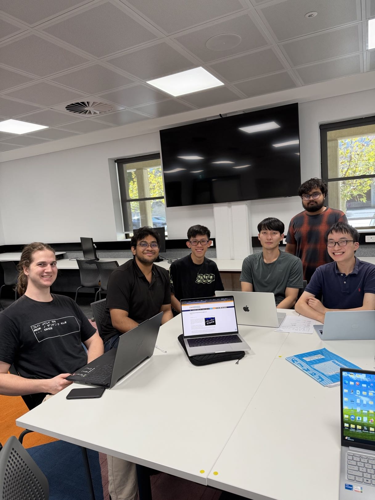

Activity A20: Participate in a discussion with your friends about cybersecurity event

## Objective
To discuss a real-world cybersecurity event with peers and understand different perspectives on its causes and mitigation.

## Methodology
I participated in an in person discussion with my friends about a recent cybersecurity incident involving Cisco SD-WAN vulnerabilities. The discussion took place in person and continued through online chat.

In-person discussion with peers about cybersecurity topics.

## Findings

### 1. Real-World Vulnerability Discussion
We discussed a vulnerability in Cisco SD-WAN systems, where attackers exploited authentication weaknesses to gain unauthorized access.

### 2. Different Perspectives
Different viewpoints were shared:
- Some suggested improving authentication mechanisms to prevent unauthorized access
- Others pointed out that SD-WAN systems are complex, with dynamic routing and many nodes, increasing the attack surface

### 3. Root Cause
The vulnerability is related to improper authentication mechanisms, allowing attackers to bypass authentication and gain elevated privileges.

### 4. Agreed Mitigation
All participants agreed that regularly updating software is critical, as patches are released to fix known vulnerabilities.

## Analysis
This discussion highlights that cybersecurity issues often involve multiple factors, including system design complexity and authentication mechanisms. 

Real-world incidents such as the Cisco SD-WAN vulnerability show that even advanced network technologies can contain critical flaws. Attackers have exploited authentication bypass vulnerabilities to gain administrative access to systems.

## Evidence
- Photo of in-person discussion with peers

## Reflection
This activity demonstrated the importance of collaborative discussion in understanding cybersecurity problems. Different perspectives helped identify both technical causes and practical mitigation strategies.
