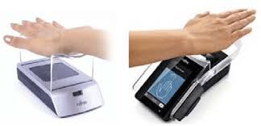
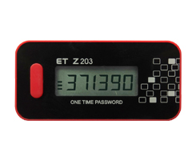

# Activity A11: Discover 5 unique access control devices

## Objective
To analyse five advanced access control devices based on their working principles, applications, and security characteristics.

## Devices and Analysis

### 1. Fingerprint Sensor (Optical / Capacitive / Ultrasonic)
- **Application**: Smartphones, smart locks, safes  
- **Principle**: Captures ridge patterns of fingerprints and matches them against stored templates  

- **Limitations**:
  - Fingerprint wear, ageing effects
  - Residual prints may be lifted and reused
  - Coercion (forced unlocking)

---

### 2. Vein Recognition (Palm/Finger Vein Scanner)
- **Application**: ATMs, high-security facilities  
- **Principle**: Uses near-infrared light to capture vein patterns beneath the skin

Example of a vein recognition device using near-infrared imaging to capture unique vein patterns for secure access control.

- **Limitations**:
  - Sensitive to health conditions (e.g., low blood flow)
  - Cannot be changed if compromised

---

### 3. Voiceprint-based Access (Acoustic Booth Systems)
- **Application**: Secure facilities, remote authentication  
- **Principle**: Analyses voice features such as frequency and resonance  

- **Limitations**:
  - Sensitive to noise and health conditions
  - Vulnerable to AI-generated voice (deepfake attacks)

---

### 4. Gait Recognition System
- **Application**: Surveillance-based access control  
- **Principle**: Analyses walking patterns and body movement  

- **Limitations**:
  - Easily affected by injury or disguise
  - Raises privacy concerns

---

### 5. Dynamic Smart Card / Token (E-Ink / OTP-based Card)
- **Application**: Corporate access control systems  
- **Principle**: Generates dynamic authentication codes that change periodically

Example of a one-time password (OTP) hardware token generating a time-based dynamic code for secure access control.

- **Limitations**:
  - Hardware fragility
  - Time synchronization issues

---

## Comparative Security Analysis

### 1. False Acceptance Rate (FAR)
- **Highest risk**: Voice recognition (deepfake attacks), fingerprint (spoofing possible)
- **Lowest risk**: Vein recognition (difficult to replicate due to internal structure)

---

### 2. False Rejection Rate (FRR)
- **Highest FRR**: Voice recognition (affected by illness, noise), gait (affected by movement changes)
- **Lowest FRR**: Fingerprint and smart cards (stable under normal conditions)

---

### 3. Resistance to Spoofing
- **Strongest**: Vein recognition (requires live blood flow, internal biometric)
- **Moderate**: Smart card (protected by dynamic codes)
- **Weakest**: Fingerprint (can be lifted), voice (deepfake), gait (visual imitation)

---

## Analysis
Each access control method represents a trade-off between security, usability, and cost. Biometric systems provide convenience but introduce risks related to irreversibility and spoofing. Behavioural biometrics (e.g., gait, voice) are convenient but less reliable. Token-based systems provide strong security but depend on physical integrity and synchronization.

## Reflection
This activity showed that no access control system is perfect. Systems must be evaluated based on FAR, FRR, and resistance to spoofing, depending on the threat model. Combining multiple factors (multi-factor authentication) is often the most effective approach to achieving strong security.
