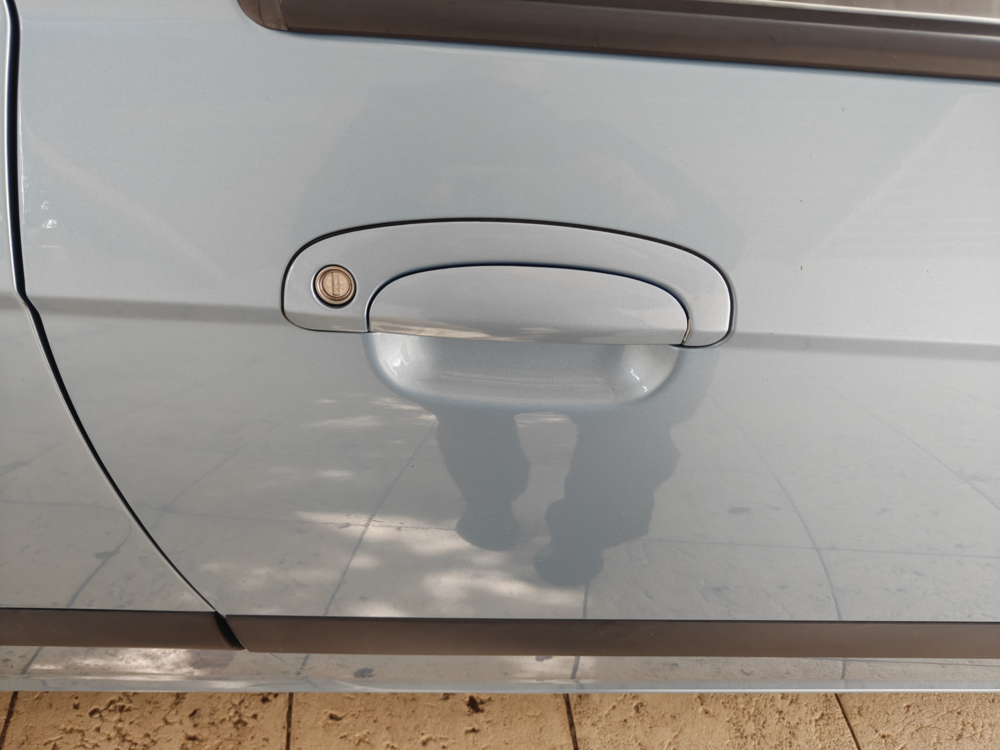
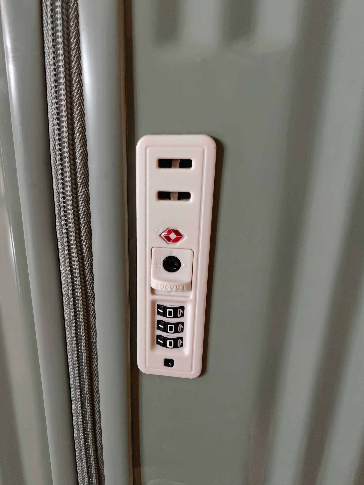
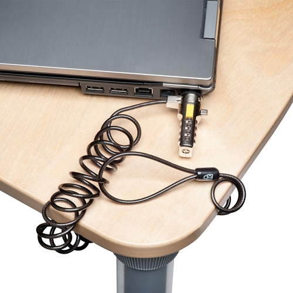
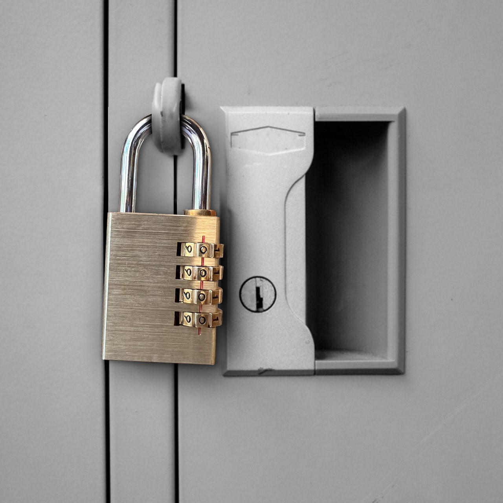
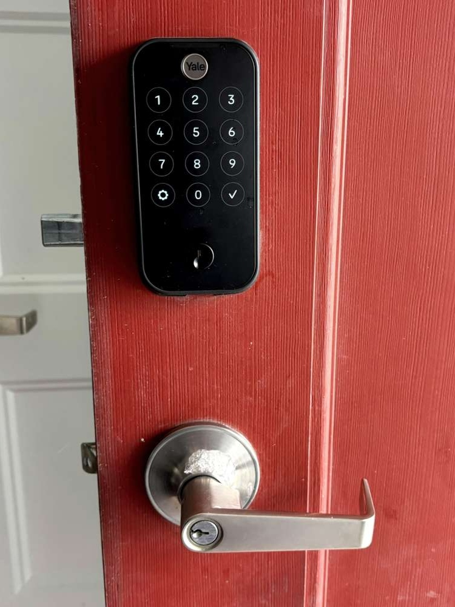

# Activity A17: Discover 10 different types of locks in use

## Objective
To identify and analyse different types of locks, including their purpose, working principles, and security limitations.

## Findings

### 1. Pin-tumbler Lock (Cylinder Lock)
- **Use**: Residential doors
- **Principle**: Uses pins that must align with a shear line when the correct key is inserted
- **Risk**: Vulnerable to lock picking, bumping, and drilling

---

### 2. Car Lock (Central Locking System)
- **Use**: Vehicles
- **Principle**: Electronic locking controlled by key fob or remote system
- **Risk**: Vulnerable to relay attacks, signal interception, and key cloning

---

### 3. Privacy Lock (Bathroom Lock)
- **Use**: Bathrooms and private rooms
- **Principle**: Simple mechanical latch with internal button/turn mechanism
- **Risk**: Easily bypassed, not designed for security

---

### 4. Keycard Lock
- **Use**: Hotels, offices
- **Principle**: RFID or magnetic stripe authentication
- **Risk**: Card cloning, weak encryption, replay attacks

---

### 5. TSA Lock (Luggage Lock)
- **Use**: Travel luggage
- **Principle**: Combination lock with master key access for authorities
- **Risk**: Master keys can be replicated; low physical security

---

### 6. Kensington Lock (Cable Lock)
- **Use**: Securing laptops
- **Principle**: Steel cable with locking mechanism attached to device slot
- **Risk**: Can be cut or physically broken

---

### 7. Bicycle Lock (Combination Lock)
- **Use**: Securing bicycles
- **Principle**: Mechanical combination or key-based locking
- **Risk**: Vulnerable to brute-force (low combinations) or cutting

---

### 8. Combination Lock
- **Use**: Lockers, safes
- **Principle**: Requires correct numeric sequence
- **Risk**: Shoulder surfing, brute-force attempts

---

### 9. Smart / Biometric Lock
- **Use**: Smart homes
- **Principle**: Uses fingerprint, app, or digital authentication
- **Risk**: Software vulnerabilities, spoofing, hacking

---

### 10. Padlock
- **Use**: General-purpose locking (gates, storage)
- **Principle**: Mechanical locking with key or combination
- **Risk**: Can be cut, picked, or shimmed

## Analysis
Locks can be broadly categorised into mechanical and electronic systems. While electronic locks provide convenience and advanced features, they introduce new risks such as software vulnerabilities and network-based attacks. Mechanical locks, on the other hand, are generally simpler but vulnerable to physical attacks.

## Reflection
This activity demonstrated that no lock is completely secure. Each type of lock involves trade-offs between usability, cost, and security. Modern locks increasingly rely on digital systems, which shifts security risks from purely physical attacks to cyber threats.
