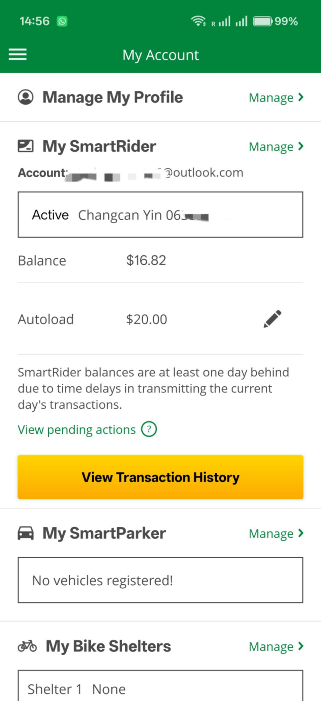
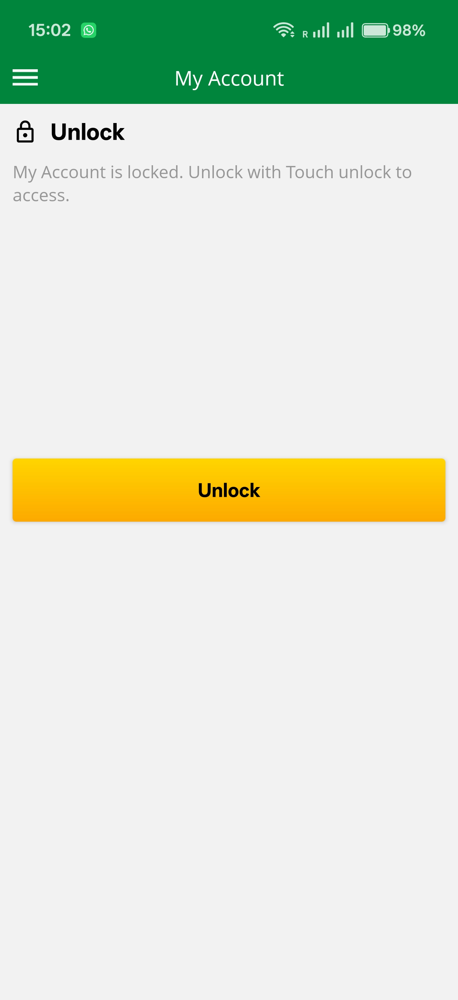
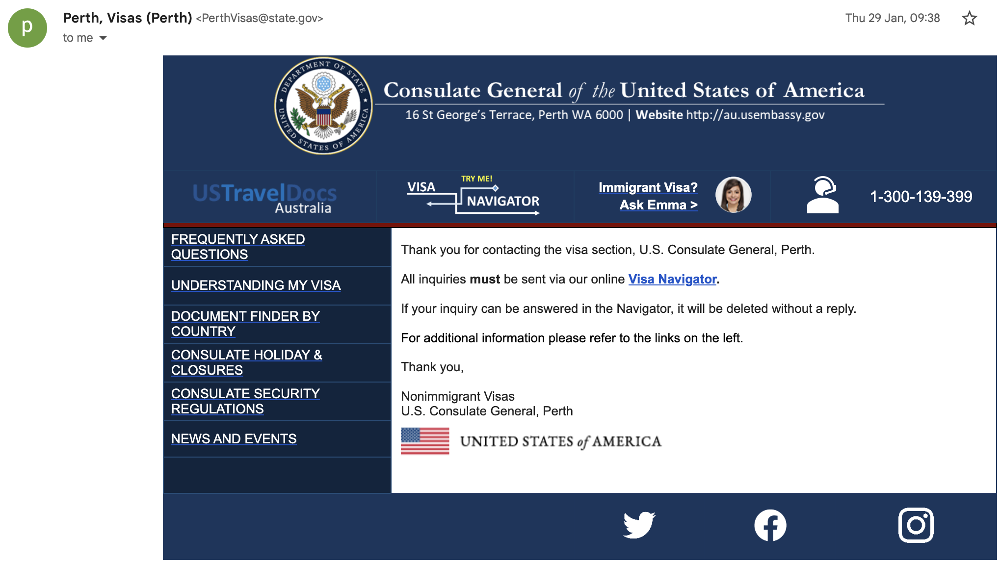
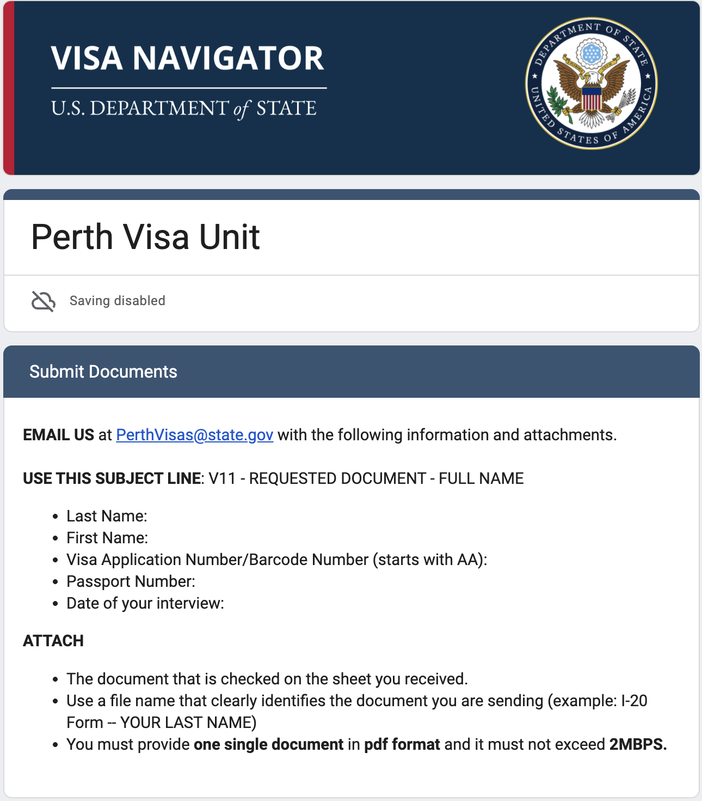
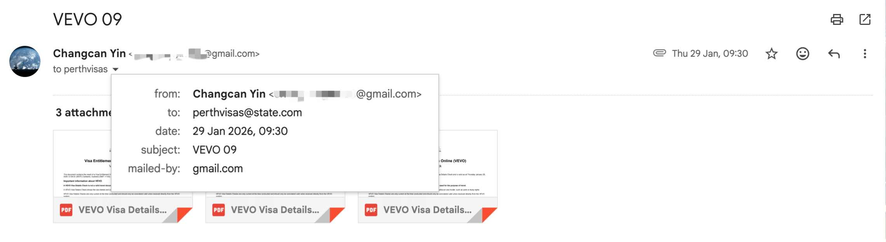

# A2. Discover security concepts used in public space.

## Objective
To identify cybersecurity concepts used in public systems such as transportation and government services.

---

## Methodology
I observed and interacted with public systems including transport services, government platforms, and official procedures. This included:
- Using the Transperth system
- Observing QR code usage at bus stops
- Interacting with government digital identity systems
- Following official visa submission procedures

---

## Findings

### 1. Public Transport System (Transperth)

Public transport systems use digital and physical mechanisms to provide secure access to services.

#### Security Concepts

- **Authentication**
  - Users can log in with account credentials
- **Multi-Factor Authentication (MFA)**
  - Login may require verification codes
- **Biometric Authentication**
  - Fingerprint login on mobile devices
- **Access Control**
  - **Registered Users**
  - Can link their SmartRider (public transport card)
  - Able to manage their card, including:
    - Viewing balance
    - Checking transaction history
    - Performing online top-ups

    
    Example of registered user interface of My Account 

- **Unregistered (Anonymous) Users**
  - Can access general features of the app, such as:
    - Viewing timetables
    - Tracking transport services
    - Journey planning
  - However, they **cannot manage SmartRider cards or access personalised features**

Anonymous users interface of My Account 

---

### 2. QR Code at Bus Stops

QR codes allow users to quickly access transport information.

#### Security Concepts
- **Convenience vs Security Trade-off**
- **Direct linking to trusted services**

#### Potential Vulnerabilities
- QR code spoofing (attacker replaces QR code)

---

### 3. Government Digital Identity (myGov + myID)

Government systems use strong identity verification to secure access.

#### Security Concepts

- **Digital Identity**
  - A secure way to prove identity online 

- **Multi-Factor Authentication**
  - Password + code + device verification 

- **Biometric Authentication**
  - Fingerprint or face recognition or password are required to open the myID application on device

- **Encryption & Privacy Protection**
  - myID uses cryptographic protection 

#### Identity Strength Levels
- Higher identity verification allows access to more goverment online services (e.g. ATO online).
- Visit https://www.myid.gov.au/how-to-set-up-myid?path=increase-your-identity-strength#myid-Identitystrength to get more information

#### Potential Vulnerabilities
- Identity theft if device is compromised
- Phishing attacks targeting login pages

---

### 4. Secure Communication in Government Systems (Visa Navigator)

During my visa application process, I encountered a security control mechanism used by the U.S. Consulate.

The consulate explicitly requires all document submissions to be sent through the official Visa Navigator system instead of direct email.

---

#### Security Concepts

- **Secure Communication Channel**
  - Users must follow controlled submission pathways

- **Input Validation**
  - Specific formats and requirements must be followed

- **Phishing Prevention**
  - Prevents users from sending sensitive data to incorrect or malicious addresses

---

#### Real-World Incident (Personal Experience)

Initially, I mistakenly sent sensitive documents to an incorrect email address:

- Intended: `perthvisas@state.gov`
- Mistyped: `perthvisas@state.com`

This email contained sensitive personal information, including visa details (VEVO).

---

#### Security Risk Analysis

If the incorrect domain (`state.com`) were controlled by a malicious actor, this could result in:

- Identity theft
- Exposure of personal documents
- Unauthorized use of visa information

This demonstrates the importance of verifying communication channels before transmitting sensitive data.

---

#### Why Visa Navigator is Important

The Visa Navigator system enforces:

- Trusted communication channels
- Structured input submission
- Reduced human error

This significantly reduces the risk of phishing and data leakage.

---

## Analysis

This activity highlights how public systems implement layered security mechanisms:

- Transport systems balance usability and security
- Government systems use strong identity verification (high assurance)
- Controlled submission systems prevent misuse of communication channels

These systems demonstrate the concept of **defense in depth**, where multiple layers of protection are applied to reduce risk.

---

## Evidence

- Screenshot of Transperth app / QR code
- Screenshot of myGov login / myID app
- Notes from visa application process

---

## Reflection

Through this activity, I realized that cybersecurity is embedded in everyday public systems. From scanning a QR code to accessing government services, multiple layers of authentication, authorization, and validation are used to protect users and data.

I also learned that stronger security often comes at the cost of convenience, especially in government systems where identity verification is critical.
