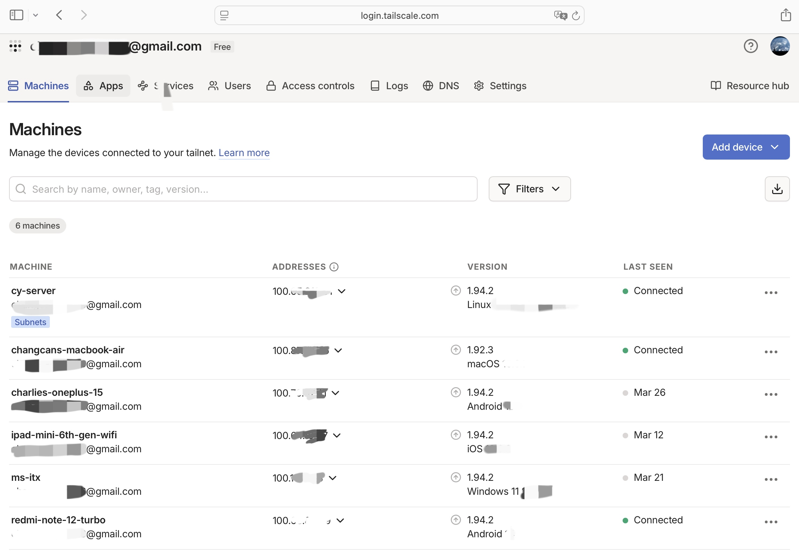
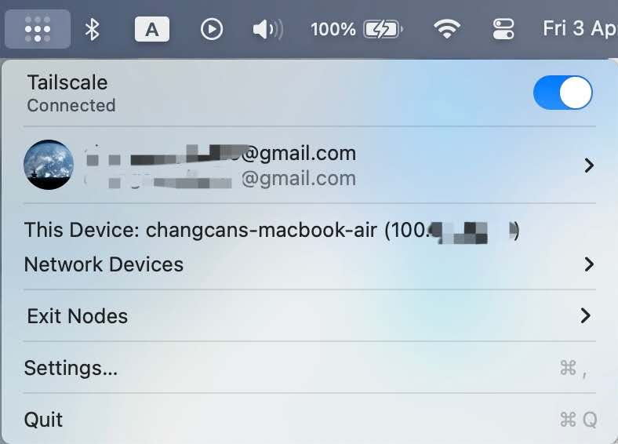
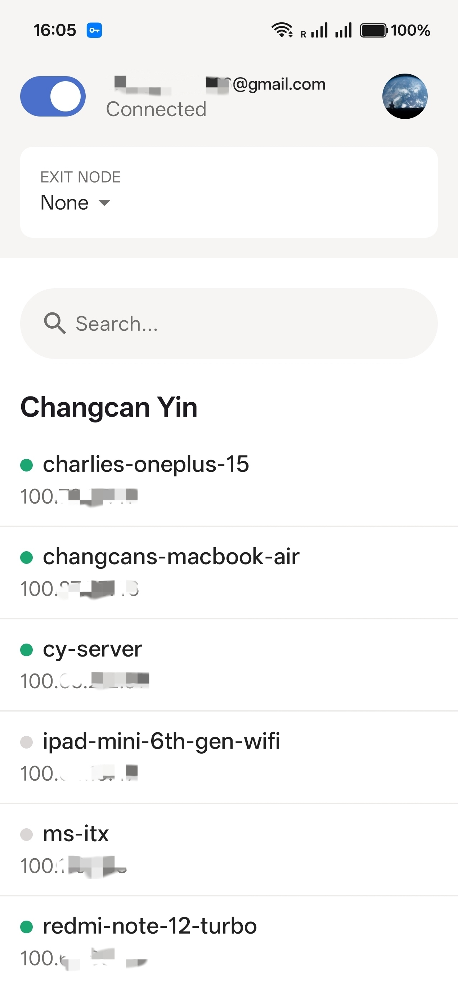

# Activity A23: Enhance the cybersecurity at your home

## Objective
To improve the cybersecurity of my home network by implementing secure remote access.

## Methodology
I deployed a VPN solution using Tailscale to securely connect my personal devices and home server. I configured multiple devices, including a MacBook, smartphone, and a Linux server, into a private network (tailnet).

The Tailscale Admin Console displays my devices and server connected within a Virtual Private Network (VPN), each assigned a unique Virtual IP address (Tailscale IP).

## Findings

### 1. Encrypted VPN Communication
Tailscale establishes a secure VPN connection between devices using modern cryptographic protocols. All communication is encrypted end-to-end.

### 2. Private Network (Tailnet)
Devices are assigned private IP addresses (100.x.x.x), forming a secure virtual network that is isolated from the public internet.

### 3. Secure Remote Access
I can securely access my home server (cy-server) remotely without exposing services to the public internet.

### 4. Multi-Device Integration
Multiple devices (MacBook, phone, server) are connected securely within the same network, enabling safe communication across different platforms.

Tailscale connected on macOS device

Tailscale connected on Android device

### 5. Subnet Routing
I configured my home server (cy-server) as a subnet router because it is a stable, always-on device located within my home network.
By assigning the subnet routing role to this server, I can securely access other devices in my local network through it. Since the server is permanently connected and accessible, it serves as a reliable gateway to the internal network.
This design avoids exposing internal services directly to the internet while still allowing remote access through a secure VPN connection.

## Analysis
Using a VPN significantly enhances home network security by reducing the need to expose services through public ports. This minimizes the attack surface and prevents unauthorized access.
End-to-end encryption ensures confidentiality and integrity of data, while device authentication ensures only trusted devices can join the network.

## Evidence
- Screenshot showing Tailscale connected on MacBook
- Screenshot showing connected devices on mobile app
- Screenshot of Tailscale admin panel listing devices

## Reflection
This activity demonstrated how VPN technologies can be used to enhance home cybersecurity. By creating a secure private network, I was able to safely access internal services without compromising security.
