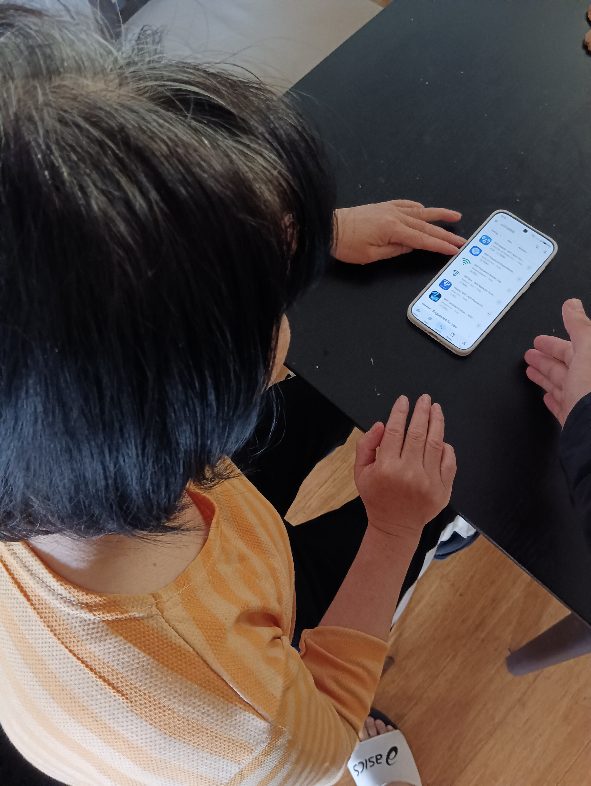
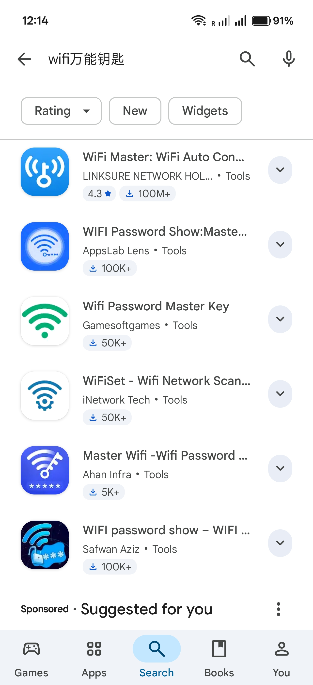

# Activity A24: Teach your family about a cybersecurity topic

## Objective
To educate a family member about cybersecurity risks related to unsafe mobile applications.

## Methodology
I explained to my mother the risks associated with downloading applications that claim to "unlock" or "crack" WiFi passwords, such as WiFi Master-type apps.

Explaining cybersecurity risks of unsafe mobile applications to a family member

Example of mobile applications claiming to provide WiFi password access, which may pose security and privacy risks.

## Explanation

I explained that applications claiming to hack or crack WiFi passwords are misleading. In reality, most of these apps do not break encryption. Instead, they operate by:

- Collecting saved WiFi passwords from users' devices  
- Uploading this data to a central server  
- Sharing the collected passwords with other users  

This means users are unknowingly sharing their own WiFi credentials with strangers.

## Risks Identified

### 1. Local Network Exposure
These apps are not "free". They exchange access by sharing your own WiFi credentials. This allows unknown users to connect to your home network, potentially gaining access to devices within the local network (e.g., cameras, computers, IoT devices).

### 2. Privacy and Data Leakage
Users may unknowingly share sensitive network information without understanding how it is used or distributed.

### 3. Risk of Fake or Malicious WiFi (Evil Twin Attack)
Connecting to "free WiFi" can be dangerous, as attackers may create fake access points (phishing WiFi). This can compromise:

- **Confidentiality**: Unencrypted traffic can be intercepted (e.g., man-in-the-middle attacks)
- **Integrity**: Data can be modified or malicious software injected
- **Authenticity**: DNS spoofing or fake login pages can steal credentials

## Outcome

After the discussion, my mother understood that such applications are unsafe and agreed not to install or use them in the future.

## Reflection

This activity demonstrated that many cybersecurity risks arise from misunderstanding how applications work. Users may trust apps that appear helpful but actually compromise their privacy and security.

It also shows that improving cybersecurity awareness is often more effective than relying solely on technical solutions, as human behaviour is a critical factor in maintaining security.
