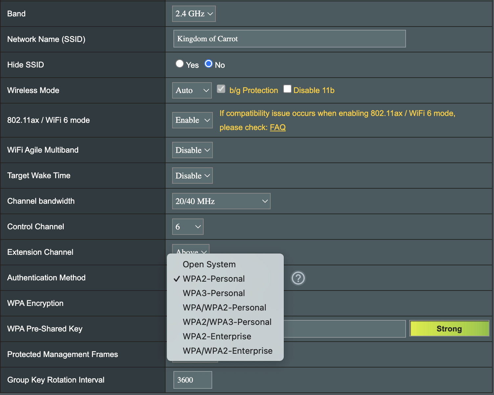
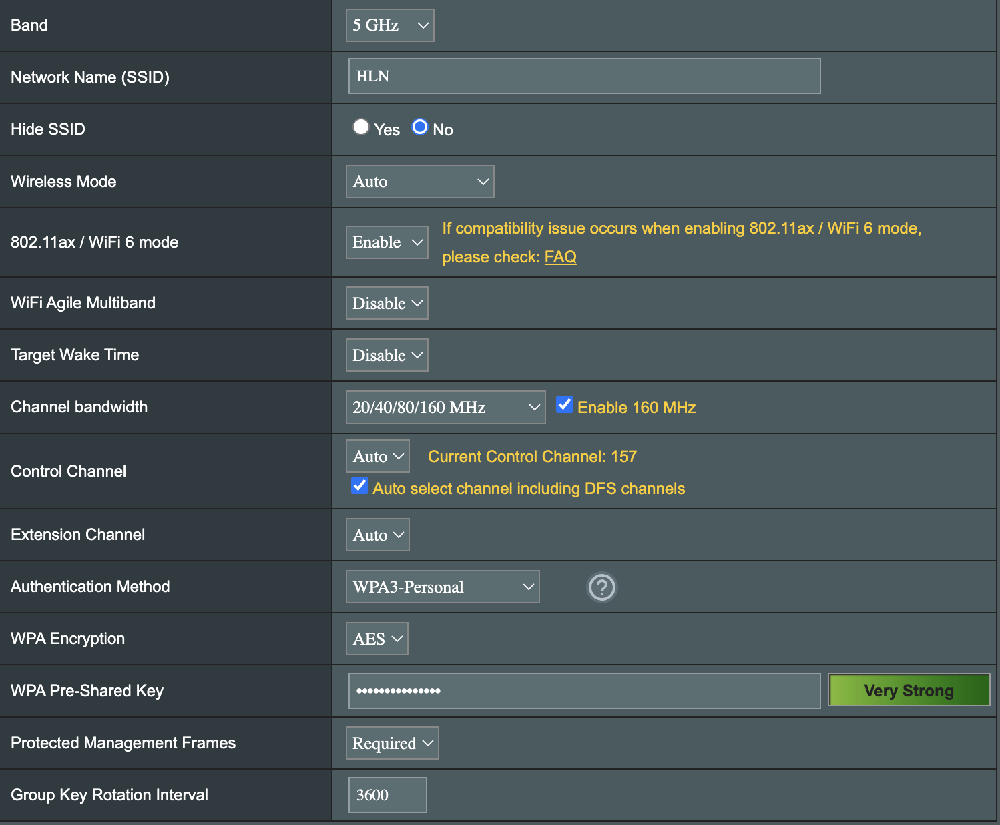
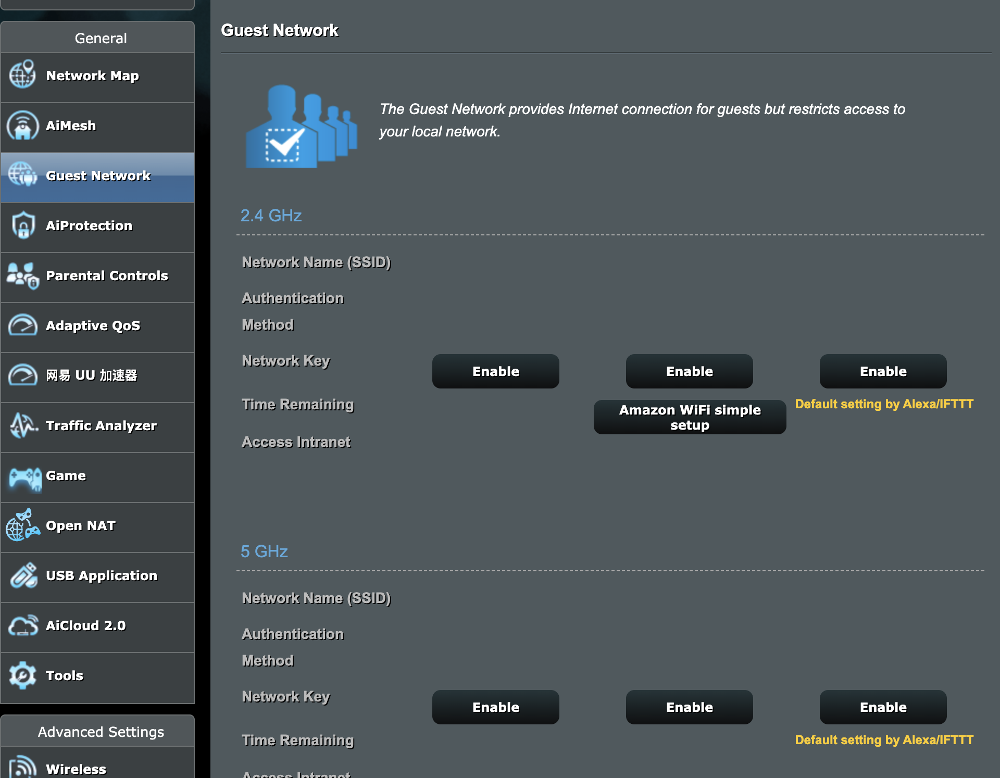
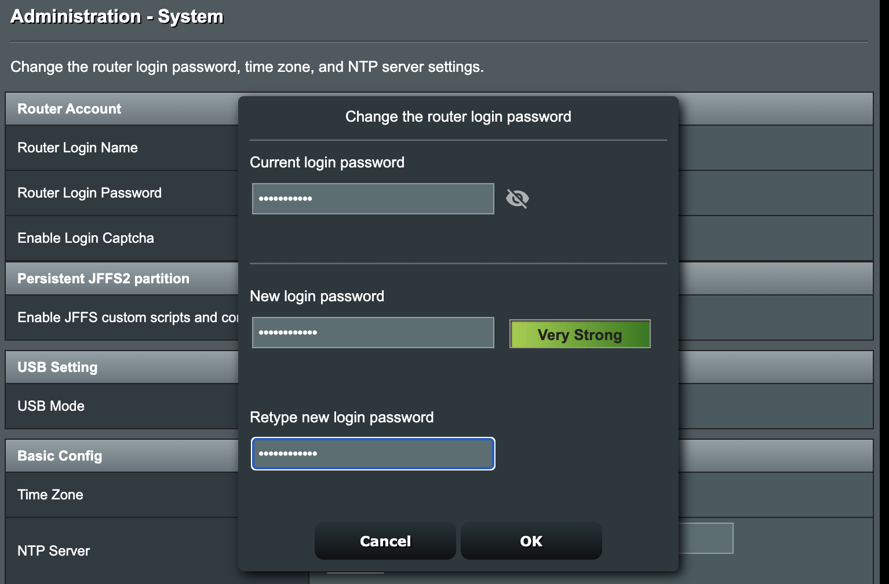
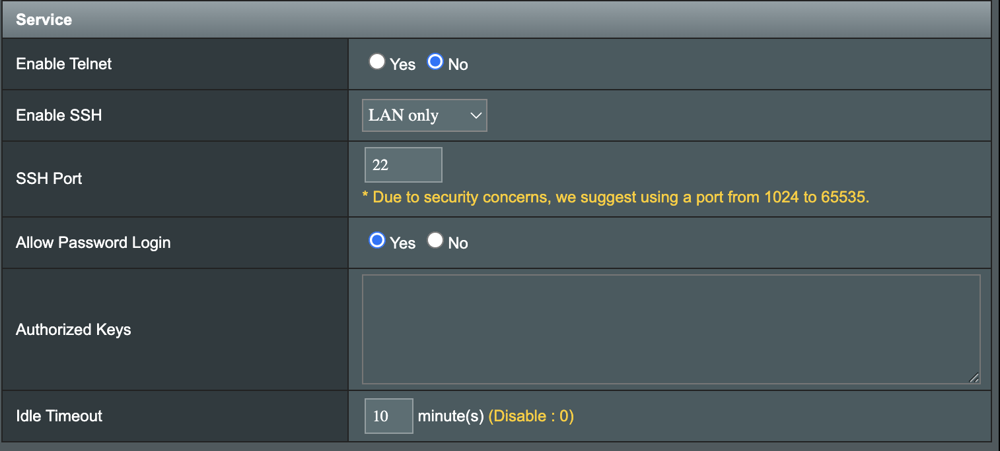

# Activity A3 - Discover Security Concepts Used at Home

## Objective
To identify and analyze cybersecurity mechanisms implemented in a home network environment.

---

## Methodology
I examined my home network setup, including router configurations, wireless network settings, and access control mechanisms.

---

## Findings

### 1. WiFi Security (WPA2 vs WPA3)

The home network uses:
- **2.4GHz WiFi → WPA2**
- **5GHz WiFi → WPA3**

#### Security Concepts
- **Encryption**
  - WPA2 uses AES encryption
  - WPA3 provides stronger encryption and protection against brute-force attacks

- **Authentication**
  - Password-based authentication (Pre-Shared Key)

#### Analysis
WPA3 offers improved security compared to WPA2, especially against offline password cracking attacks. However, WPA2 is still used for compatibility with older devices like IoT device.

#### Potential Vulnerabilities
- Weak passwords can still be guessed
- WPA2 networks are more vulnerable to brute-force attacks

---

### 2. Guest WiFi Network

A separate guest WiFi network is enabled for visitors.

#### Security Concepts
- **Network Segmentation**
  - Separates guest devices from the main network, guest cannot detect and access devices on LAN.

- **Access Control and Bandwidth Management**
  - Guest networks allow to implement stricter firewall rules and set bandwidth limits to ensure that guest activities do not degrade the performance of LAN internet services.

#### Analysis
This prevents untrusted devices from accessing sensitive devices such as personal computers or IoT systems

#### Potential Vulnerabilities
- If misconfigured, guests may access internal devices

---

### 3. Router Credential Security

The default router username and password have been changed.

#### Security Concepts
- **Authentication**
- **Default Credential Protection**

#### Analysis
Default credentials are widely known and often targeted by attackers. Changing them significantly reduces the risk of unauthorized access.

#### Potential Vulnerabilities
- Weak custom passwords may still be exploited

---

### 4. Disabling Telnet

Telnet access on the router has been disabled.

#### Security Concepts
- **Secure Communication**
- **Protocol Hardening**

#### Analysis
Telnet transmits data in **plaintext**, making it vulnerable to interception (e.g., sniffing attacks). Disabling Telnet reduces this risk.

---

### 5. SSH Access Restriction

SSH access is restricted to LAN only.

#### Security Concepts
- **Access Control**
- **Network Restriction**

#### Analysis
Restricting SSH to local network access prevents remote attackers from attempting brute-force attacks over the internet.

#### Potential Vulnerabilities
- If LAN is compromised, SSH could still be accessed
- Password are vulnerable to brute force compromised, enforcing key-based authentication only significantly reduces the attack surface

---

## Analysis

The home network demonstrates a layered security approach:

- WiFi encryption protects wireless communication
- Guest network isolates untrusted users
- Router hardening reduces attack surface
- Secure protocols (SSH instead of Telnet) protect management access

This reflects the concept of **defense in depth**, where multiple security mechanisms work together to reduce overall risk.

---

## Evidence

- Screenshot of WiFi settings (WPA2/WPA3)
- Screenshot of guest network settings
- Router admin settings (password changed)
- Screenshot showing Telnet disabled
- SSH configuration (LAN only)

---

## Reflection

This activity helped me understand how cybersecurity concepts are applied in a home environment. Even simple configurations, such as changing default passwords or disabling insecure protocols, can significantly improve security.

It also highlighted that security is not a single feature but a combination of multiple layers working together.
