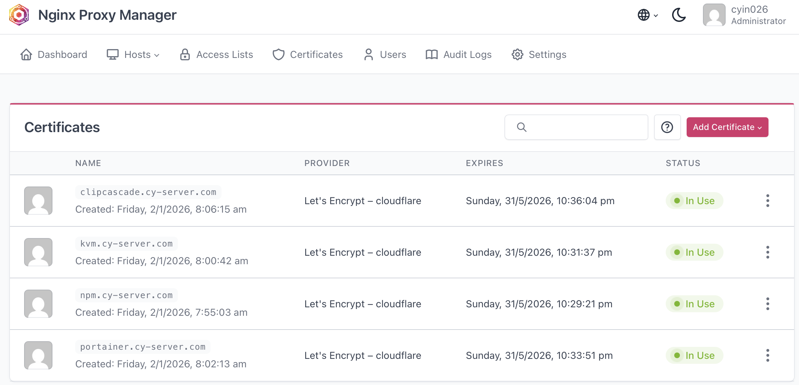

# Activity A5: Discover cryptographic implementation used online

## Objective
To identify cryptographic implementations used in online services.

## Methodology
I examined my own hosted services using Nginx Proxy Manager. I reviewed the SSL/TLS certificates configured for multiple subdomains under my domain (cy-server.com).

## Findings

### 1. TLS Encryption (HTTPS)
All services are accessed via HTTPS, which ensures encrypted communication between users and the server.

### 2. Digital Certificates
Each subdomain (e.g., clipcascade.cy-server.com, portainer.cy-server.com) is configured with SSL certificates issued by Let's Encrypt via Cloudflare.

### 3. Certificate Management
Certificates are automatically generated and managed through Nginx Proxy Manager, ensuring secure and up-to-date encryption.

### 4. Subdomain Protection
Each service is isolated using subdomains, and each subdomain has its own valid certificate, preventing browser security warnings.

### 5. Certificate Details

The SSL certificate uses ECDSA with SHA-384 as the signature algorithm. The public key is based on elliptic curve cryptography (secp384r1), which provides strong security with efficient performance.

The certificate is issued by Let's Encrypt and is valid for a limited time period, ensuring regular renewal and improved security.

This demonstrates the use of modern cryptographic standards in securing online services.

## Analysis
The use of TLS encryption ensures confidentiality and integrity of data transmitted over the network. By using trusted certificate authorities such as Let's Encrypt, the system verifies server identity and prevents man-in-the-middle attacks.

Additionally, applying certificates to all subdomains improves overall security and user trust, as browsers recognise the connections as secure.

## Evidence
- Screenshot of Nginx Proxy Manager showing active SSL certificates for multiple subdomains

## Reflection
This activity demonstrated how cryptographic techniques such as TLS and digital certificates are implemented in real-world systems. Managing certificates properly ensures secure communication and protects users from potential network attacks.
