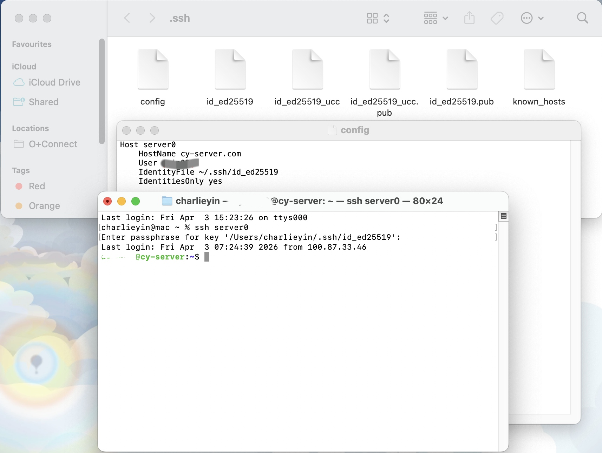
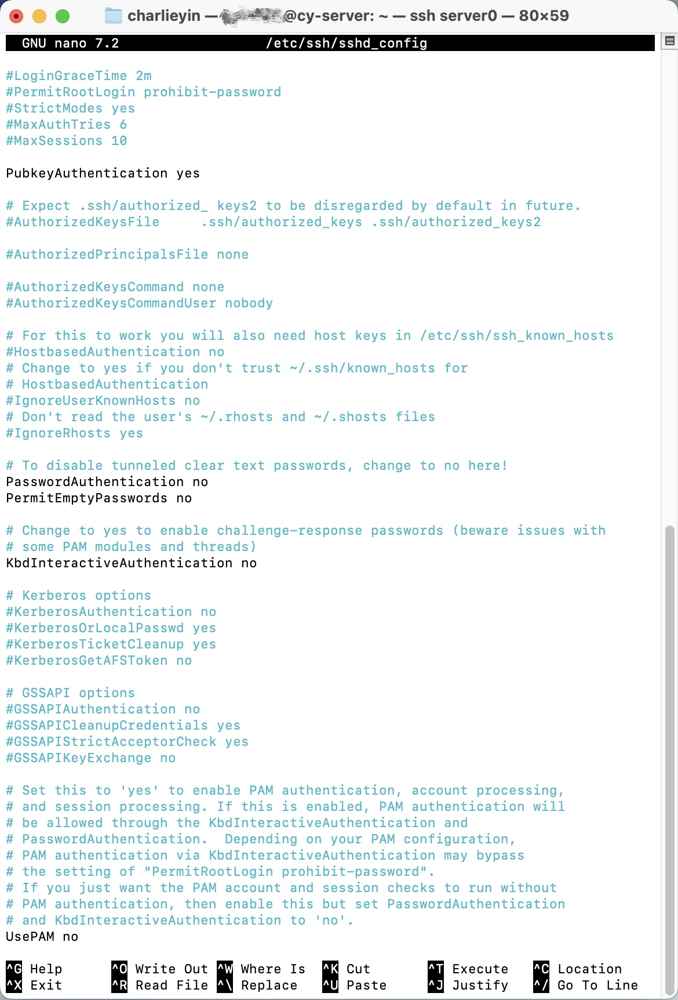

# Activity A7: Discover cryptography used in modern networks

## Objective
To identify cryptographic techniques used in modern network communication.

## Methodology
I examined the SSH (Secure Shell) protocol used to remotely access my server (cy-server.com). I analysed both the authentication mechanism and server configuration.

SSH to my server using keypass

## Findings

### 1. Encrypted Communication (SSH)
SSH provides encrypted communication between the client and the server, ensuring confidentiality and integrity of transmitted data.

### 2. Public Key Authentication
The system uses public key cryptography:
- Private key stored on the client device
- Public key stored on the server

Authentication is performed without transmitting passwords.

### 3. Password Authentication Disabled
The SSH server configuration disables password-based authentication:
- PasswordAuthentication no
- PubkeyAuthentication yes

This ensures that only users with the correct private key can access the system.

Screenshot of Configuration of my server SSH setting, showing it not allow to login via password. 

### 4. Strong Authentication Mechanism
Using key-based authentication significantly reduces the risk of brute-force attacks and credential theft.

## Analysis
SSH demonstrates the use of modern cryptographic techniques in network communication. Encryption ensures secure data transmission, while public key authentication enhances access control.

Disabling password authentication further strengthens security by eliminating common attack vectors such as brute-force password guessing.

## Evidence
- Screenshot showing successful SSH login to remote server
- Screenshot of SSH configuration enforcing key-based authentication

## Reflection
This activity demonstrated how cryptography is applied in real-world network systems. SSH provides a secure method for remote access by combining encryption with strong authentication mechanisms.
