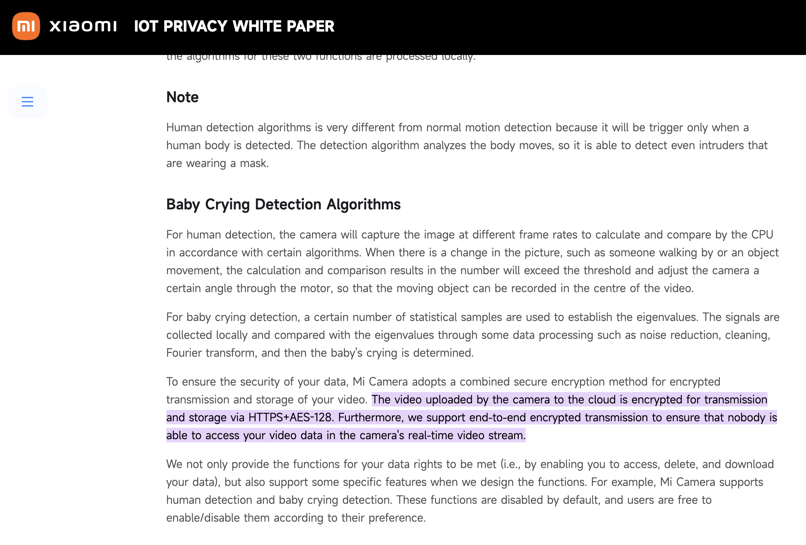

# Activity A8: Discover cryptography used in Internet of Things devices

## Objective
To investigate cryptographic techniques used in IoT devices.

## Methodology
I analysed a real IoT device (Xiaomi smart camera) and examined the official Xiaomi IoT Privacy White Paper to understand its cryptographic implementation.

Example of an IoT device (Xiaomi smart home camera) used to analyse cryptographic implementation.

Screenshot from Xiaomi IoT Privacy White Paper showing the use of HTTPS and AES-128 encryption for secure data transmission and storage.

## Evidence

Figure 1: Xiaomi smart home camera used as an example IoT device.

Figure 2: Screenshot from Xiaomi IoT Privacy White Paper showing encryption methods.

## Findings

### 1. Encryption in IoT Devices
According to Xiaomi's official documentation, video data from the camera is:
- Encrypted during transmission using HTTPS (TLS)
- Encrypted during storage using AES-128
- Protected with end-to-end encryption

### 2. Lightweight Cryptography
Instead of using heavy algorithms such as AES-256 or RSA, IoT devices typically use:
- AES-128 (lighter than AES-256)
- Efficient protocols such as TLS
- Optimised implementations for low-power devices

### 3. Security Design
The device ensures:
- Confidentiality (encrypted data transmission)
- Integrity (secure protocols)
- Privacy (end-to-end encryption prevents unauthorized access)

## Analysis
IoT devices are resource-constrained, so lightweight cryptography is necessary. Xiaomi’s use of HTTPS and AES-128 demonstrates a balance between performance and security.

## Reflection
This activity highlighted that IoT devices are becoming increasingly critical in modern networks, but also potentially **one of the weakest security points**. As computational power continues to grow, brute-force attacks are becoming more feasible, especially against devices with limited resources and weaker cryptographic implementations.

Looking forward, the emergence of quantum computing presents an even greater threat to current cryptographic systems. Post-quantum algorithms such as Kyber (ML-KEM) and Dilithium (ML-DSA) are being developed to address these risks. However, these algorithms are significantly larger and more resource-intensive, making their adoption in resource-constrained IoT devices challenging. Future research will likely focus on optimising these algorithms to fit embedded systems while maintaining acceptable performance and cost.

In addition, IoT security is not only about cryptographic algorithms themselves, but also about implementation security. Side-channel attacks, such as Differential Power Analysis (DPA) and electromagnetic leakage, can be used to extract cryptographic keys even when strong algorithms are used. This highlights the need for secure hardware design and countermeasures beyond software-level encryption.

Overall, IoT security requires a balance between efficiency, cost, and strong cryptographic protection, and will continue to evolve as new threats emerge.
